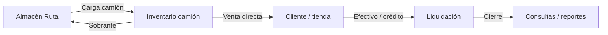

# Proyecto: Venta en Ruta (CEDIS)

**Estado:** propuesta para revisión (sin implementar aún)  
**Fecha:** 2026-08-06  
**Alcance:** sucursal / contexto **CEDIS** · comando nuevo **Venta en Ruta** con subcomandos  
**Referencia de negocio:** modelo tipo Sabritas / Barcel / Pepsi (preventa o venta directa en ruta)

---

## 1. Qué problema resuelve

Hoy el flujo de surtido es:

```
CEDIS (MAIN) ──traspaso──► piso de sucursal ──venta POS──► cliente
```

Lo que se quiere:

```
Almacén Ruta (propio, aislado) ──carga a camión──► vendedor en ruta ──venta directa──► cliente / tienda
```

Reglas explícitas del negocio:

| Antes | Después |
|--------|---------|
| MAIN surte sucursales | **MAIN ya no surte** sucursales por este canal |
| Traspasos CEDIS → tienda | **No se usan traspasos** para este flujo |
| Stock CEDIS = stock MAIN | **Almacén propio de Ruta** que **no interfiere** con MAIN |
| Venta solo en caja POS (piso) | **Ventas directas** desde la ruta |

---

## 2. Principio de aislamiento (crítico)

### 2.1 Dos mundos de inventario

| Mundo | Dónde vive | Para qué |
|--------|------------|----------|
| **MAIN / CEDIS actual** | `stock_sucursales.MAIN.cedis` + piso tiendas | Se mantiene para lo que ya existe (ajustes, consultas históricas). **No** se usa para surtir tiendas vía este módulo. |
| **Almacén Venta en Ruta** | Nuevo pool: `stock_ruta` / ubicación `ruta` (o sucursal lógica `RUTA`) | Único stock que carga camiones y vende en ruta. |

**Nada de lo que pase en Venta en Ruta mueve el CEDIS de MAIN ni el piso de las tiendas** (salvo que en una fase 2 se decida un “abastecimiento inicial” controlado y explícito).

### 2.2 Por qué no reutilizar traspasos

- Traspaso = envío + recepción (stock en tránsito, dos pasos).
- Ruta Sabritas = **carga** (sale del almacén ruta) + **venta** (cobro / consignación) + **liquidación** (vuelve sobrante / efectivo / crédito).
- Mezclar ambos enreda roles, reportes y el stock de tienda.

---

## 3. Comando y subcomandos (UX)

### 3.1 Comando principal

- **Nombre:** `Venta en Ruta`
- **Visible en:** sesión CEDIS / central (y roles autorizados: Admin, Gerente, Supervisor, Repartidor según privilegio).
- **Patrón UI:** igual que Contabilidad / Productos → hub de subcomandos (`SubcomandosHub`).

### 3.2 Subcomandos propuestos (v1)

| # | Subcomando | Quién | Qué hace |
|---|------------|-------|----------|
| 1 | **Almacén ruta** | Admin / Gerente | Existencias del almacén aislado: consulta, ingresos, retiros, ajustes. **No toca MAIN.** |
| 2 | **Rutas y vendedores** | Admin / Gerente | Alta de rutas (ej. Norte, Sur), asignación de vendedor/repartidor, días, zona. |
| 3 | **Carga de camión** | Admin / Bodega / Vendedor | Armar pedido de carga desde Almacén ruta → inventario del camión (folio de carga). |
| 4 | **Venta en ruta** | Vendedor | Vender desde el stock del camión (efectivo / transferencia / crédito cliente). Ticket de ruta. |
| 5 | **Devoluciones / sobrante** | Vendedor | Al cerrar ruta: regresar producto no vendido al almacén ruta (o merma). |
| 6 | **Liquidación de ruta** | Admin / Supervisor / Vendedor | Cuadre: ventas − crédito − gastos + efectivo entregado. Cierre de jornada. |
| 7 | **Clientes de ruta** | Admin / Vendedor | Catálogo de clientes/tiendas de la ruta (no es el mismo que proveedor POS). |
| 8 | **Consultas ruta** | Todos con acceso | Historial: cargas, ventas, liquidaciones, inventario camión vs almacén. |

> En v1 se pueden lanzar solo **1, 3, 4, 6, 8** y dejar 2, 5, 7 en fase 2 si prefieres un MVP más corto.

---

## 4. Modelo de datos (propuesto)

### 4.1 Inventario aislado

Opción recomendada (clara y auditable):

```
productos.stock_ruta          — piezas en Almacén Venta en Ruta (no MAIN)
-- o tabla dedicada:
inventario_ruta (producto_id, cantidad, updated_at)
```

Y por camión / jornada:

```
ruta_cargas (
  id, folio, ruta_id, vendedor_id, fecha, estado: armada|en_ruta|liquidada|cancelada
)
ruta_carga_lineas (
  carga_id, producto_id, qty_cargada, qty_vendida, qty_devuelta, qty_merma
)
```

### 4.2 Ventas de ruta (separadas de `ventas` POS)

```
ruta_ventas (
  id, carga_id, cliente_id?, folio,
  total, metodo_pago, vendedor_id, created_at,
  articulos jsonb
)
```

**No** usar la tabla `ventas` del POS de tienda (evita mezclar corte de caja, turnos y reportes de sucursal).

### 4.3 Liquidación

```
ruta_liquidaciones (
  id, carga_id,
  venta_efectivo, venta_transfer, venta_credito,
  efectivo_entregado, diferencia, notas, cerrado_at, cerrado_por
)
```

### 4.4 Catálogos

```
rutas (id, nombre, zona, activo)
ruta_clientes (id, ruta_id, nombre, direccion, credito_limite, activo)
```

---

## 5. Flujos operativos (día típico)



1. **Abastecer Almacén Ruta** (compra/ingreso dedicado, o transferencia *única* inicial desde CEDIS MAIN — solo si se aprueba; por defecto el proyecto asume ingresos propios al almacén ruta).
2. **Cargar camión** → baja Almacén Ruta, sube inventario de esa carga.
3. **Vender en ruta** → baja inventario camión, genera `ruta_ventas`.
4. **Devolver sobrante** → baja camión, sube Almacén Ruta.
5. **Liquidar** → cuadre de dinero; carga pasa a `liquidada`.

---

## 6. Qué NO hace este módulo (límites v1)

- No reemplaza de golpe el POS de sucursal (caja, turnos, corte).
- No mueve stock de piso de FUSION / 3B2 / etc.
- No usa `inventario_traspasos` ni pantallas de Traspasos.
- No descuenta `MAIN.cedis` al vender (salvo decisión explícita de “puente” en fase posterior).
- Repartidor actual (recolecciones de efectivo) sigue existiendo; **Venta en Ruta** es otro rol/privilegio o extensión clara del mismo perfil.

---

## 7. Roles y privilegios

| Rol | Almacén | Carga | Venta | Liquidación | Consultas |
|-----|---------|-------|-------|-------------|-----------|
| Administrador | ✓ | ✓ | ✓ | ✓ | ✓ |
| Gerente | ✓ | ✓ | ✓ | ✓ | ✓ |
| Supervisor | consulta | ✓ | ✓ | ✓ | ✓ |
| Repartidor / Vendedor ruta | — | ver su carga | ✓ su ruta | entregar liquidación | su historial |
| Cajero tienda | — | — | — | — | — |

Nuevo privilegio sugerido: módulo `Venta en Ruta` + subprivilegios por subcomando (como Contabilidad).

---

## 8. Impacto en código existente (cuando se implemente)

| Área | Acción |
|------|--------|
| `roles.js` / `privilegios.js` / `moduloIcons.js` / `App.jsx` | Registrar comando `Venta en Ruta` |
| Nuevo `src/modules/VentaEnRuta.jsx` | Hub + subvistas |
| Nuevo `src/lib/ventaEnRuta*.js` | Stock ruta, cargas, ventas, liquidación |
| `supabase/fix_venta_en_ruta.sql` | Tablas nuevas |
| Traspasos / MAIN surtido | **No borrar aún**; documentar deprecación y ocultar a roles de ruta cuando el módulo esté activo |
| `Ventas.jsx` / `descontarStockPorVenta` | Sin cambios (sigue siendo piso de tienda) |

---

## 9. Fases de entrega

### Fase A — Fundación (MVP operable)
1. Comando + hub de subcomandos.
2. Almacén ruta (CRUD stock aislado + ingreso/retiro).
3. Carga de camión + Venta en ruta (efectivo) + Consultas básicas.
4. Liquidación simple (efectivo esperado vs entregado).

### Fase B — Ruta completa
5. Clientes de ruta + crédito.
6. Devoluciones / merma.
7. Rutas y asignación de vendedores.
8. Impresión de tickets / remisión de carga.

### Fase C — Cierre con operación actual
9. Política oficial: MAIN deja de surtir por traspaso (ocultar/avisar).
10. Reportes vs Sabritas (venta por ruta, por vendedor, merma %, liquidación).
11. (Opcional) Puente controlado CEDIS MAIN → Almacén Ruta solo con rol Admin.

---

## 10. Decisiones que necesito que confirmes

1. **¿El Almacén Ruta nace vacío** y se llena con ingresos propios, o permitimos **una sola** carga inicial desde el CEDIS de MAIN?
2. **¿A quién se vende en ruta?** ¿Clientes externos (abarrotes), sucursales propias, o ambos?
3. **¿Preventa** (pedido hoy, entrega mañana) o solo **venta directa** con stock en camión (v1)?
4. **¿Crédito a cliente** en v1 o solo efectivo/transferencia?
5. **¿Deprecamos Traspasos** solo para usuarios de ruta, o los ocultamos a todos cuando este módulo esté en producción?
6. Nombre del almacén en pantalla: **«Almacén Ruta»**, **«CEDIS Ruta»** u otro.

---

## 11. Criterio de éxito (v1)

- Existe el comando **Venta en Ruta** con al menos Almacén, Carga, Venta, Liquidación, Consultas.
- Mover stock en ruta **no cambia** existencias de MAIN.cedis ni piso de tiendas.
- Una jornada se puede: cargar → vender → liquidar, con historial auditable.
- Traspasos no intervienen en ese flujo.

---

## 12. Siguiente paso

Tras tu revisión de este documento:

1. Ajustamos alcance (MVP corto vs completo).
2. Congelamos respuestas a la §10.
3. Recién entonces se implementa Fase A en código + SQL.

**No se ha escrito lógica de producción todavía** — solo este proyecto.
