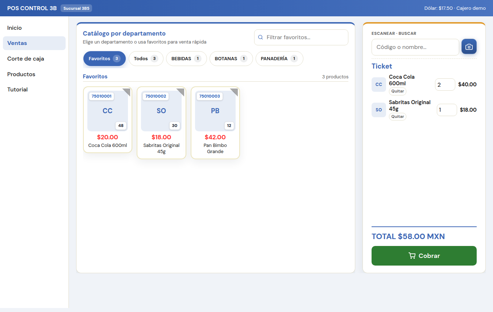
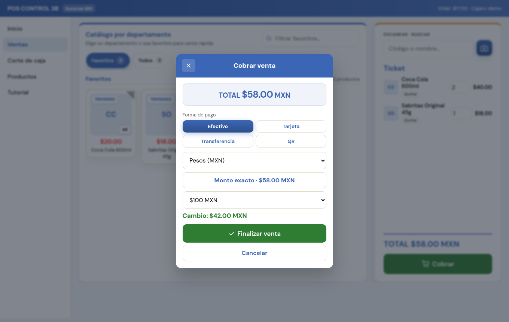
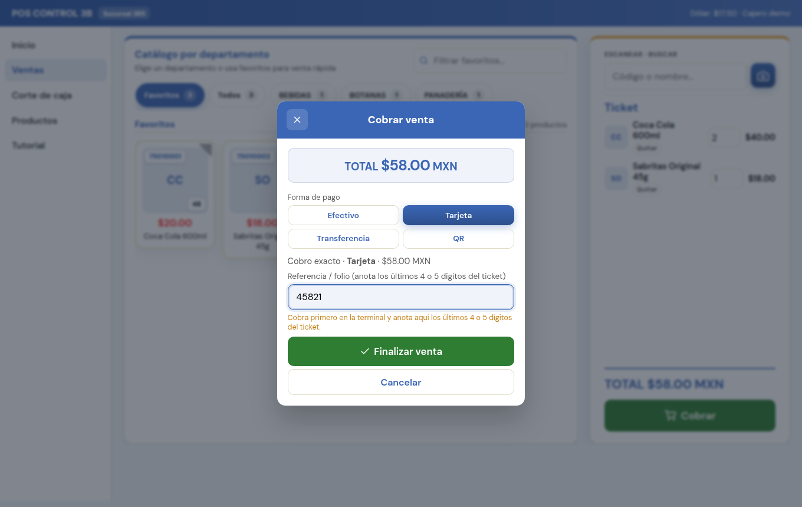
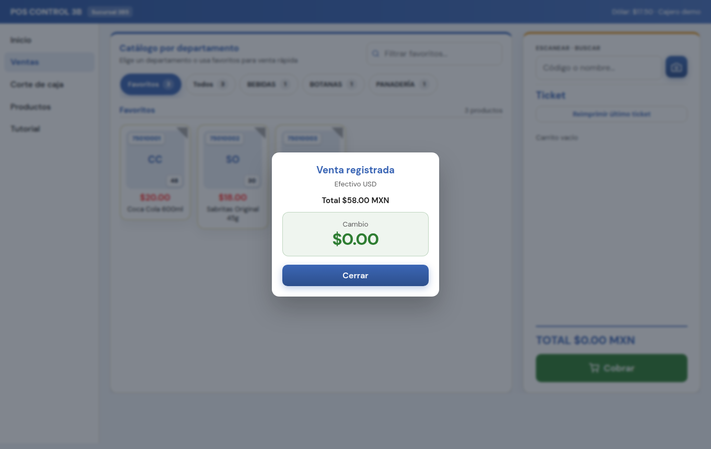

# Tutorial: Cómo cobrar en el POS

Cobro de productos en **Ventas**: ticket → Cobrar → efectivo (pesos o dólares) o tarjeta → Finalizar.

> **En el POS:** menú → **Tutorial** → *Cómo cobrar en el POS*

Las capturas son de la pantalla real de **Ventas** (no mockups).

---

## 1. Arma el ticket y pulsa Cobrar

1. En **Ventas**, agrega productos (escaneo o catálogo).
2. Revisa el ticket a la derecha (líneas, total).
3. Pulsa **Cobrar**.

---

## 2. Efectivo en pesos (MXN)

1. Elige **Efectivo**.
2. Moneda **MXN**.
3. Indica el billete / monto recibido (o **Monto exacto**).
4. Revisa el **cambio** y pulsa **Finalizar venta**.

---

## 3. Efectivo en dólares (USD)

1. **Efectivo** → moneda **USD**.
2. El POS usa el tipo de cambio del día (arriba: *Dólar*).
3. Elige el monto en dólares; el sistema calcula el equivalente y el cambio en MXN.
4. **Finalizar venta**.

---

## 4. Tarjeta

1. Cobra primero en la **terminal**.
2. En el POS elige **Tarjeta**.
3. En **Referencia / folio** anota los **últimos 4 o 5 dígitos** del ticket de la terminal.
4. **Finalizar venta**.

---

## 5. Venta registrada

Aparece **Venta registrada** con método, total y cambio. Pulsa **Cerrar**. El ticket se imprime según la configuración de la tienda.

---

## Errores frecuentes

- Cobrar sin revisar el ticket (producto o cantidad incorrecta).
- En tarjeta: olvidar cobrar en la terminal o no anotar los últimos dígitos.
- En dólares: no verificar el tipo de cambio del día.

---

## Frase para capacitar

**Ventas → ticket → Cobrar → Efectivo (MXN/USD) o Tarjeta (últimos 4–5 dígitos) → Finalizar.**
