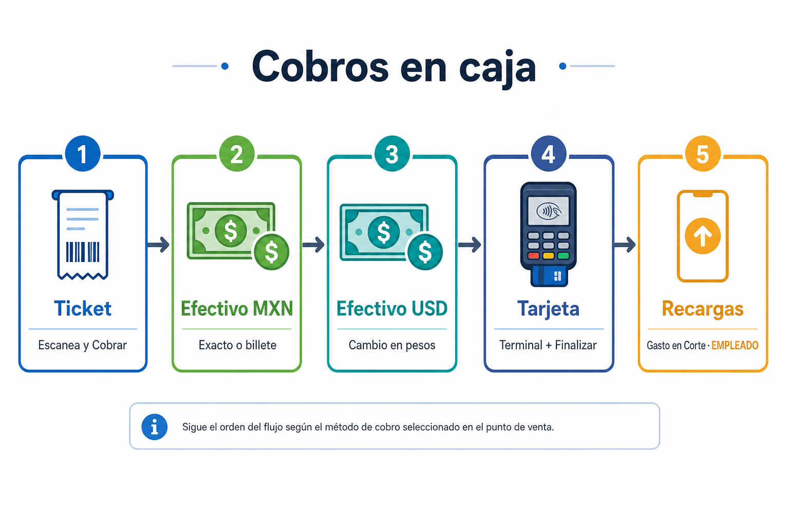
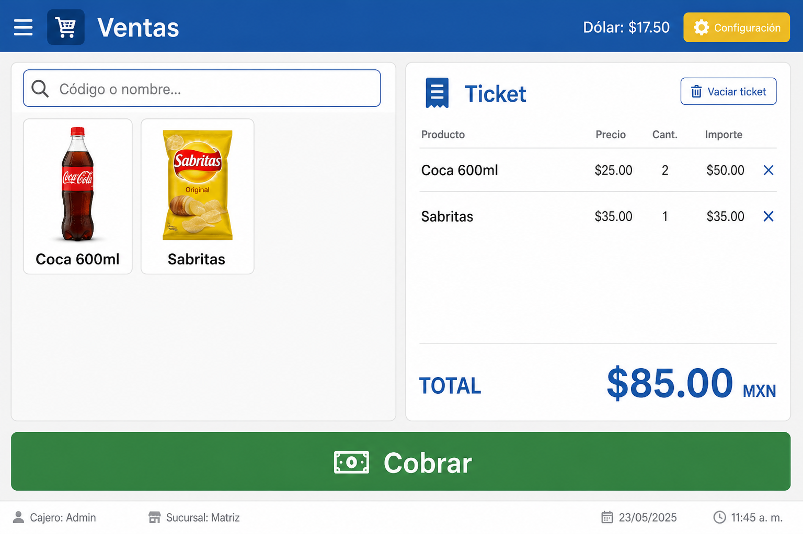
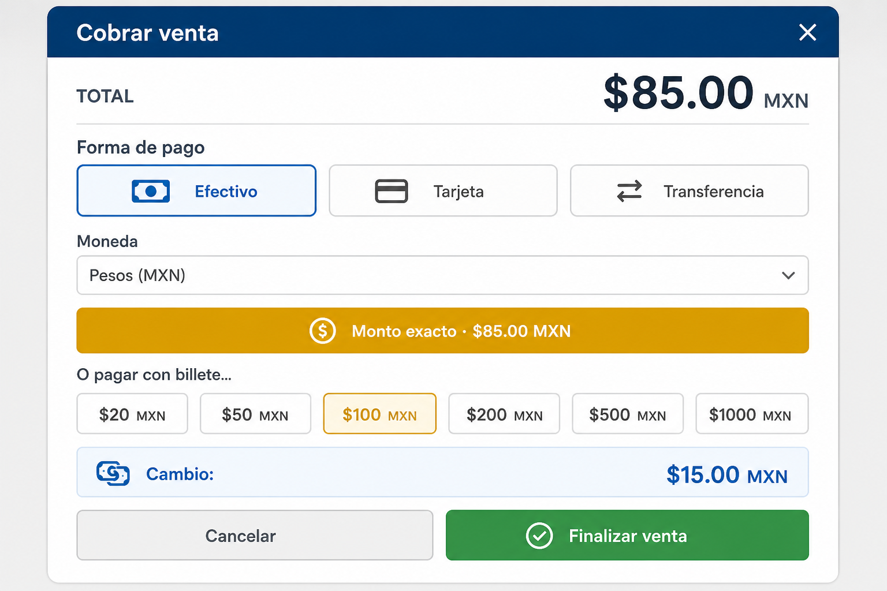
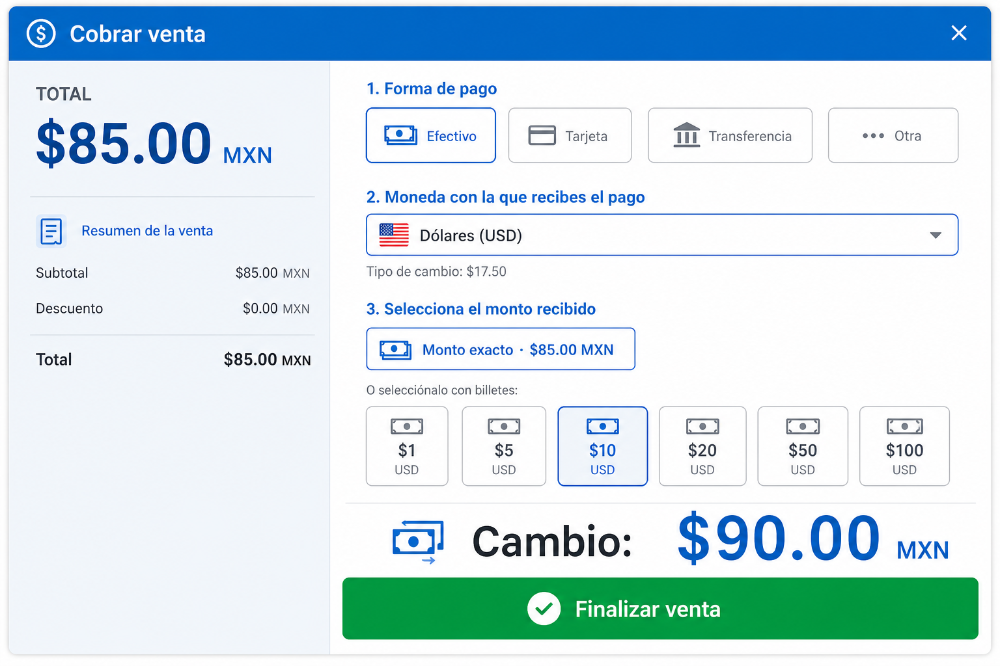
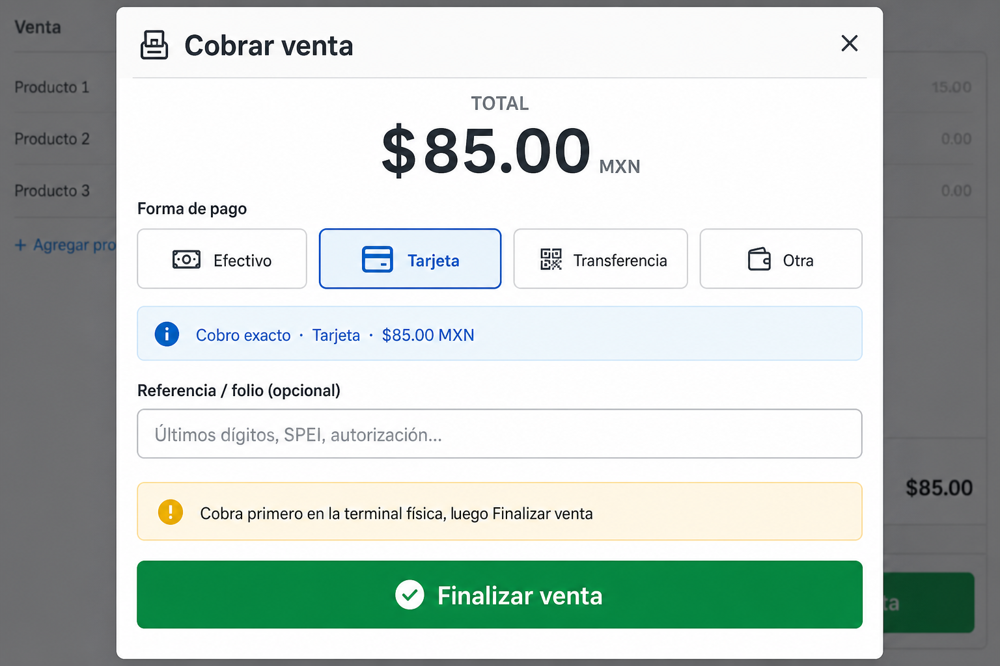
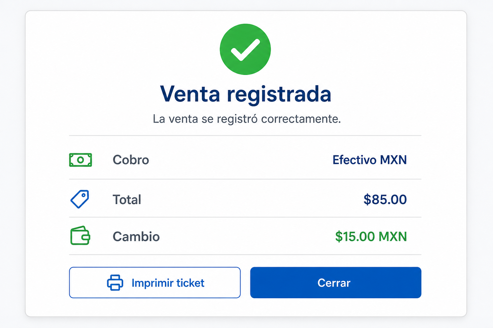
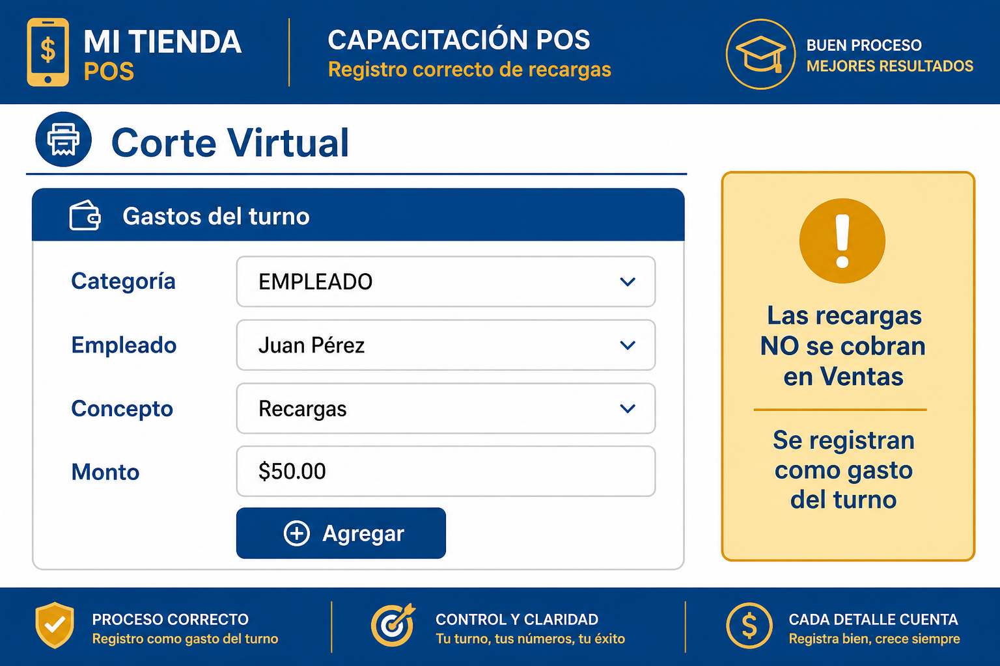

# Tutorial: Cobros en caja (efectivo, dólares, tarjeta y recargas)

Guía ilustrada para cajeros.

> **En el POS:** menú lateral → **Tutorial** → *Cobros en caja…*

---

## 1. Mapa

| Qué | Dónde |
|---|---|
| Efectivo MXN / USD / Tarjeta | **Ventas** → **Cobrar** |
| Recargas de celular | **Corte Virtual / Abarrotes** → **Gastos del turno** (no en Ventas) |

---

## 2. Armar ticket y cobrar

1. Menú → **Ventas** (revisa la tienda).
2. Escanea o busca en **Código o nombre…** / Favoritos.
3. Revisa **TOTAL** → pulsa **Cobrar**.

---

## 3. Efectivo en pesos (MXN)

1. **Forma de pago** → **Efectivo** → **Pesos (MXN)**.
2. **Monto exacto** o billete ($20…$1000).
3. Revisa **Cambio** → **Finalizar venta**.

---

## 4. Efectivo en dólares (USD)

1. **Efectivo** → **Dólares (USD)**.
2. Exacto o billete USD ($1…$100).
3. El **cambio siempre es en MXN** (según tipo de cambio del encabezado).
4. **Finalizar venta**.

---

## 5. Tarjeta

1. **Forma de pago** → **Tarjeta**.
2. Cobra en la **terminal física**.
3. Opcional: **Referencia / folio**.
4. **Finalizar venta** en el POS.

> El POS no cobra en la terminal: solo registra.

---

## 6. Venta registrada

Revisa cobro y cambio → **Cerrar** / **Imprimir ticket**.

---

## 7. Recargas de celular

**No van en Ventas.** Se registran así:

1. **Corte Virtual** o **Corte Abarrotes** → **Gastos del turno**
2. **Categoría** = **EMPLEADO**
3. **Empleado** = persona
4. **Concepto** = **Recargas**
5. **Monto** → **Agregar**

Descuenta al empleado en nómina. Captúralas **antes** de recolectar.

---

## Frase para capacitar

> Ventas = ticket → Cobrar → Efectivo (MXN/USD) o Tarjeta → Finalizar.  
> Recargas = gasto EMPLEADO en el corte, nunca como venta.
