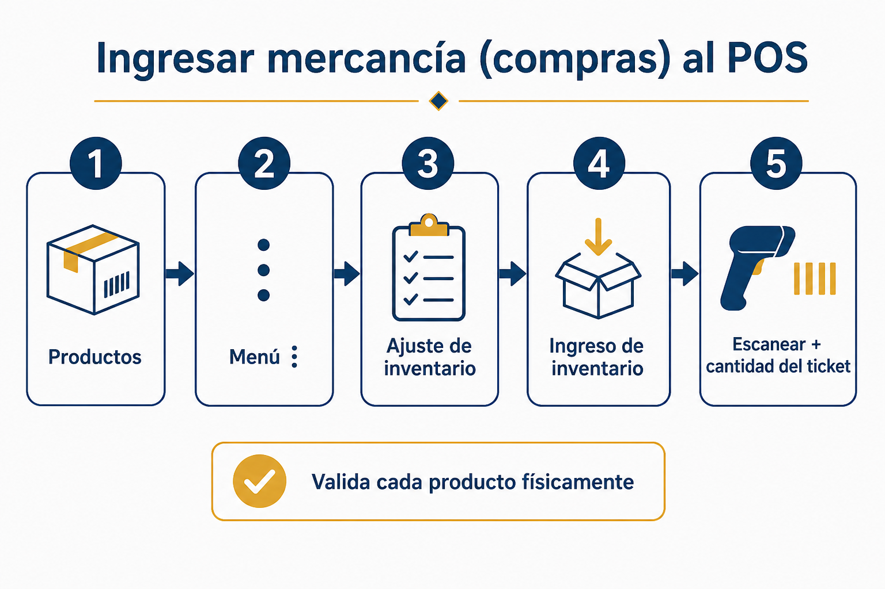
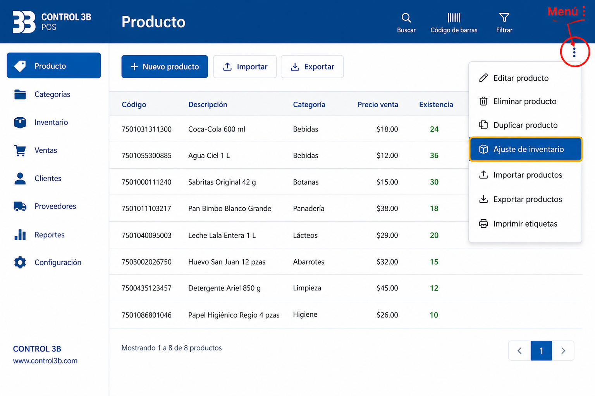
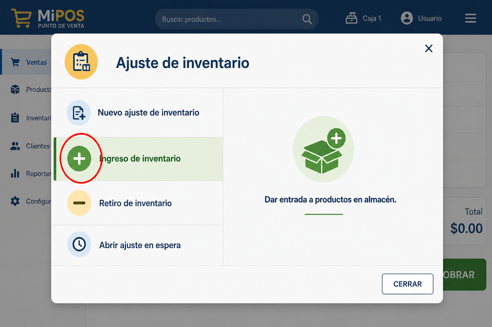
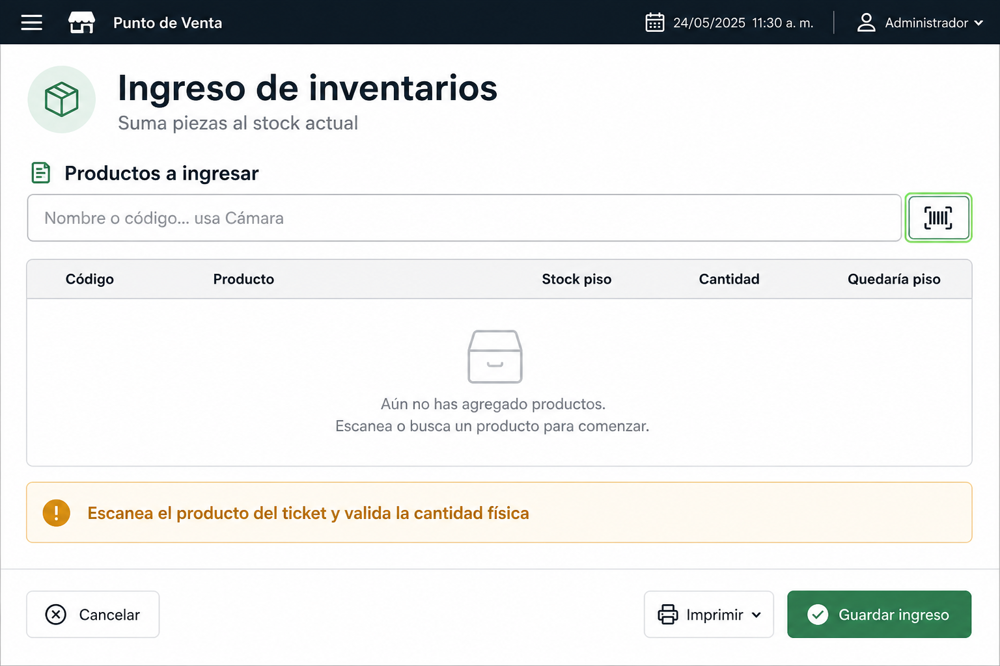
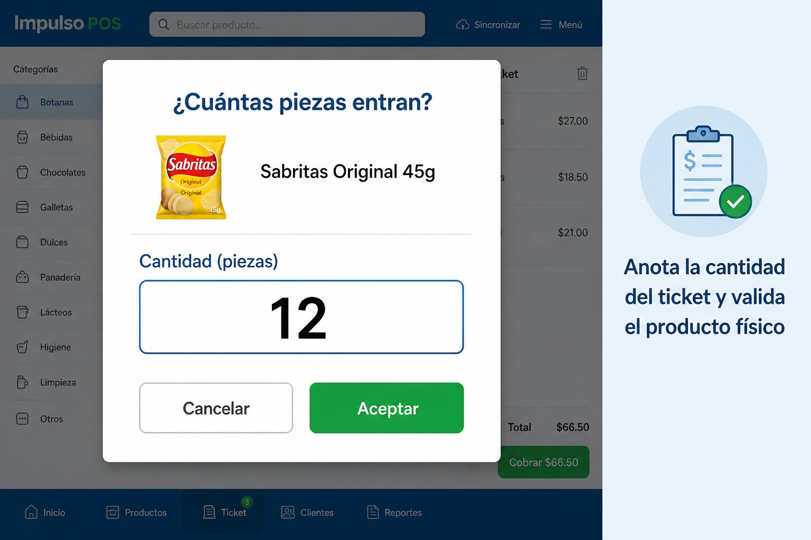
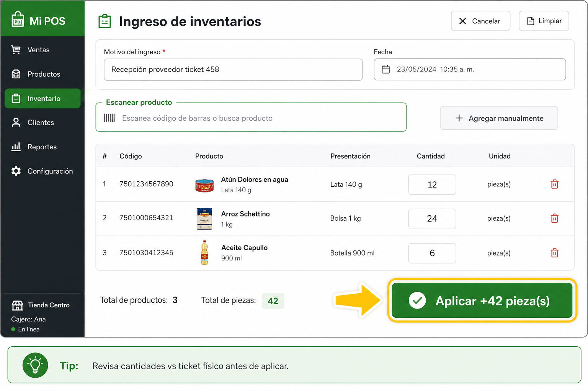

# Tutorial: Ingresar compras al sistema (Ingreso de inventario)

Así se ingresa la mercancía del proveedor en el POS CONTROL 3B.

> **En el POS:** menú → **Tutorial** → *Ingresar compras al sistema (Ingreso de inventario)*

---

## Camino

**Productos → menú ⋮ → Ajuste de inventario → Ingreso de inventario → escanear + cantidad del ticket (validar físico) → Aplicar**

---

## 1. Productos → menú ⋮

1. Abre **Productos**
2. Toca **⋮**
3. Elige **Ajuste de inventario**

---

## 2. Ingreso de inventario

En el modal, elige **Ingreso de inventario**.

---

## 3. Escanea

En **Productos a ingresar**, escanea el código (o busca por nombre).

---

## 4. Cantidad del ticket + validación física

1. Revisa el **producto físico**
2. Compara con el **ticket del proveedor**
3. Escribe la cantidad → **Aceptar**

Las piezas **suman** al stock (no lo reemplazan).

---

## 5. Aplicar

Repite por cada producto del ticket → opcional **Motivo / referencia** → **Aplicar +N pieza(s)**.

---

## Frase para capacitar

> Productos → ⋮ → Ajuste → **Ingreso de inventario**.  
> Escanea → cantidad del ticket → valida el físico → **Aplicar**.
