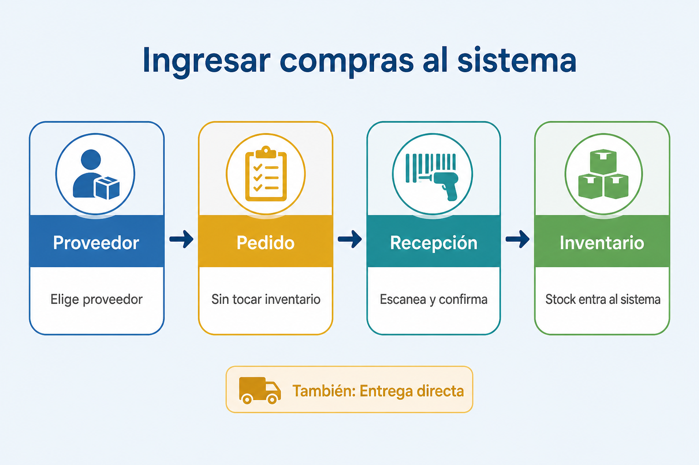
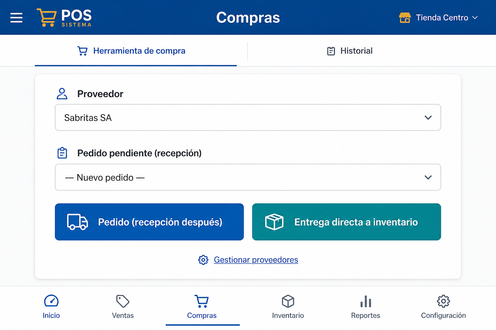
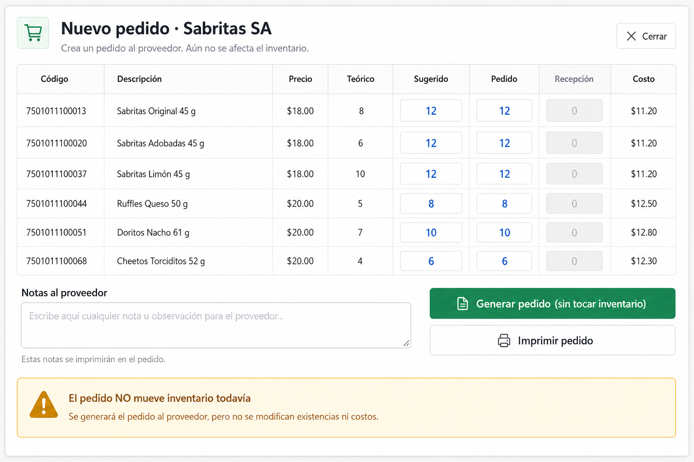
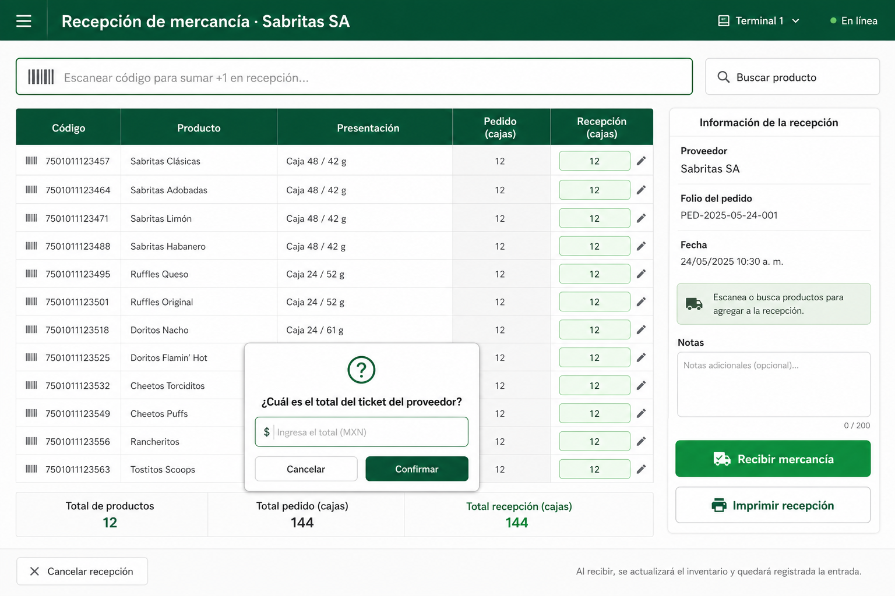
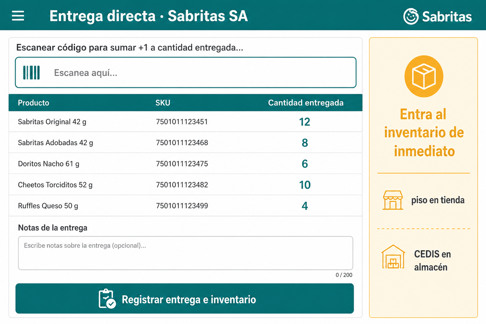
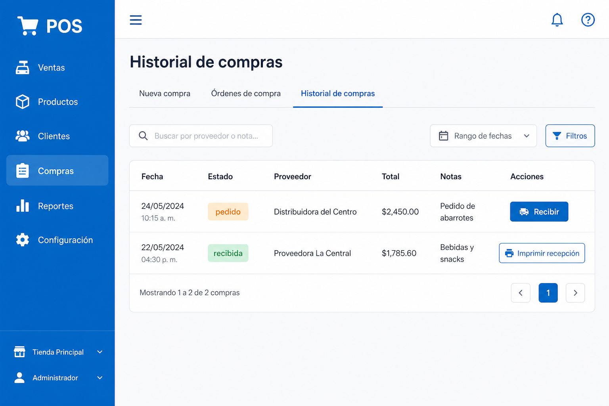

# Tutorial: Ingresar compras al sistema

Guía ilustrada para cajeros y encargados.

> **En el POS:** menú → **Tutorial** → *Ingresar compras al sistema*

---

## 1. Mapa

| Paso | Qué hace |
|---|---|
| **Pedido** | Ordena mercancía · **no** mueve inventario |
| **Recepción** | Confirma lo que llegó · **sí** sube stock |
| **Entrega directa** | Atajo: ya te entregaron · stock inmediato |

---

## 2. Elegir proveedor

1. Menú → **Compras** → **Herramienta de compra**
2. **Proveedor** → elige proveedor
3. **Pedido (recepción después)** o **Entrega directa a inventario**

---

## 3. Generar pedido

1. Captura cantidades en **Pedido** (Enter = sugerida)
2. **Generar pedido (sin tocar inventario)**
3. Opcional: **Imprimir pedido**

> El pedido **no** sube inventario.

---

## 4. Recibir mercancía

1. Elige el pedido pendiente o **Historial → Recibir**
2. Escanea / captura **Recepción**
3. **Recibir mercancía** → confirma total del ticket del proveedor
4. El stock entra al sistema

---

## 5. Entrega directa

1. **Entrega directa a inventario**
2. Captura **Cantidad entregada**
3. **Registrar entrega e inventario**

---

## 6. Historial

- **pedido** → **Recibir**
- **recibida** → imprimir

---

## Frase para capacitar

> Pedido = ordenar (sin stock). Recibir = ya llegó y **sí** sube inventario.  
> Si ya te entregaron: **Entrega directa**.
