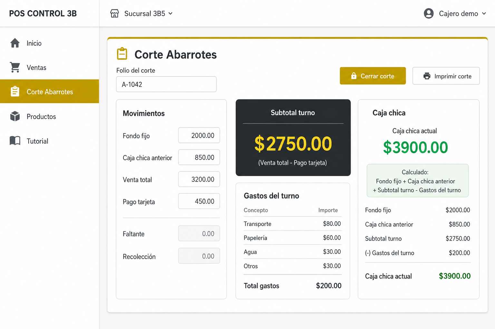
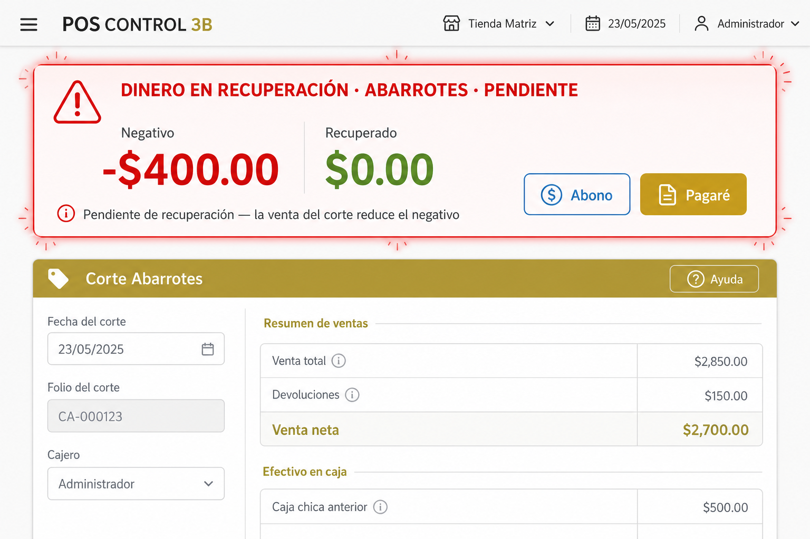
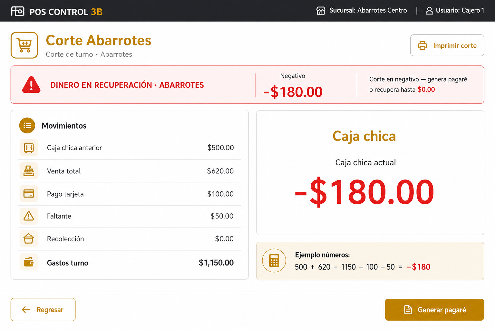
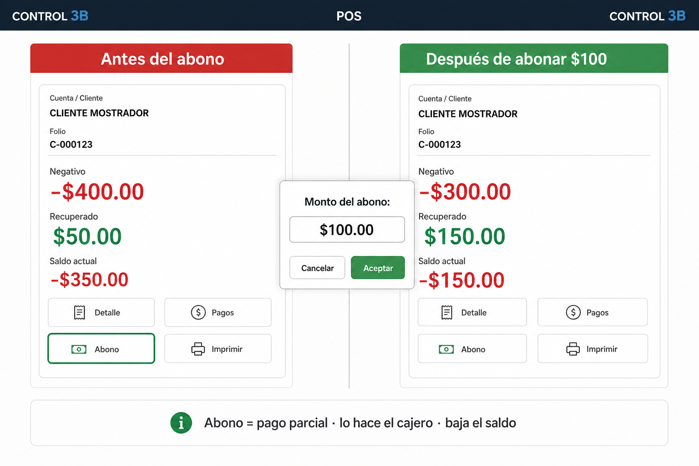
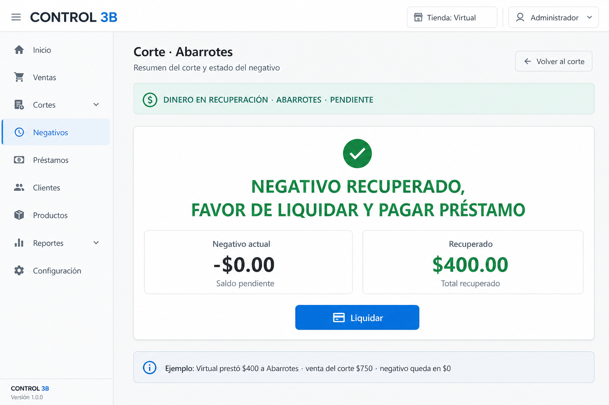
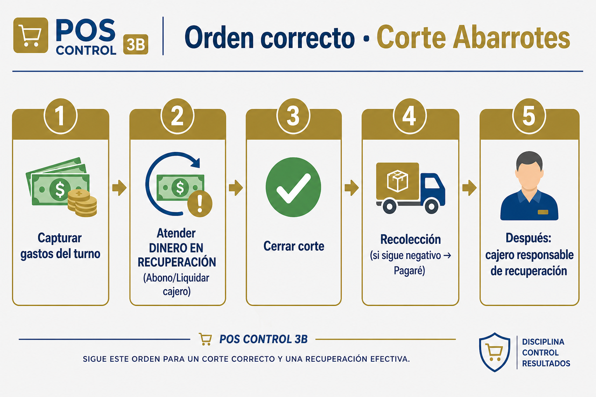

# Tutorial interactivo: Corte Abarrotes y negativos

Guía ilustrada e interactiva para capacitar en tienda (cajeros, CT, recolectores, gerentes).

> **En el POS:** menú → **Tutorial** → **Corte Abarrotes y negativos** (paso a paso, ejemplos editables y preguntas).

Documento hermano (negativos en todos los cortes): [TUTORIAL_NEGATIVOS_PAGARE_ABONOS.md](./TUTORIAL_NEGATIVOS_PAGARE_ABONOS.md).

---

## 1. La pantalla

- Independiente del corte de caja POS.
- Fórmula de caja: **Anterior + Venta − Gastos − Recolección − Faltante − Tarjeta**.
- Captura **todos** los gastos del turno (incl. bonos de caja) antes de cerrar / recolectar.

---

## 2. Qué es el Negativo

Aparece cuando hay **pagaré / préstamo de área** abierto hacia Abarrotes, o la **caja chica** está en rojo.

| Campo | Significado |
|---|---|
| **Negativo** | Lo que aún falta recuperar |
| **Recuperado** | Lo que ya cubrió la venta del corte |

### Ejemplo A — Virtual presta $400 a Abarrotes

1. Al recibir: Negativo **−$400**, Recuperado **$0**.
2. Con venta parcial $150: Negativo **−$250**, Recuperado **$150**.
3. Con venta $750: Negativo **$0**, Recuperado **$400** → el **cajero** pulsa **Liquidar**.

---

## 3. Caja chica en negativo

**Ejemplo B:** 500 + 620 − 1150 − 100 − 50 = **−$180**.  
No se recolecta en negativo: recupera / abona / documenta.

---

## 4. Abono (parcial)

- Solo si **Negativo > $0**.
- Lo hace el **cajero** (nunca el cubre turno).
- Si llega a $0, se liquida solo.

---

## 5. Liquidar

Cuando Negativo = $0 y la alerta sigue: el cajero **Liquida**. El CT solo ve el aviso.

---

## 6. Orden correcto y Pagaré

1. Gastos del turno  
2. Abono / Liquidar (cajero)  
3. Cerrar corte  
4. Recolección → si el negativo **sigue** → **Pagaré** (×2 tickets)  
5. Después: el **cajero** es responsable de la recuperación  

El Pagaré **documenta**; no cierra la deuda.

---

## Frase para capacitar

> En **Corte Abarrotes**: mete **todos** los gastos, atiende el **Negativo** (Abono/Liquidar = **cajero**), **cierra** y **después** recolecta.  
> El **Pagaré** va **al final** y **solo** si el negativo sigue en la recolección.
