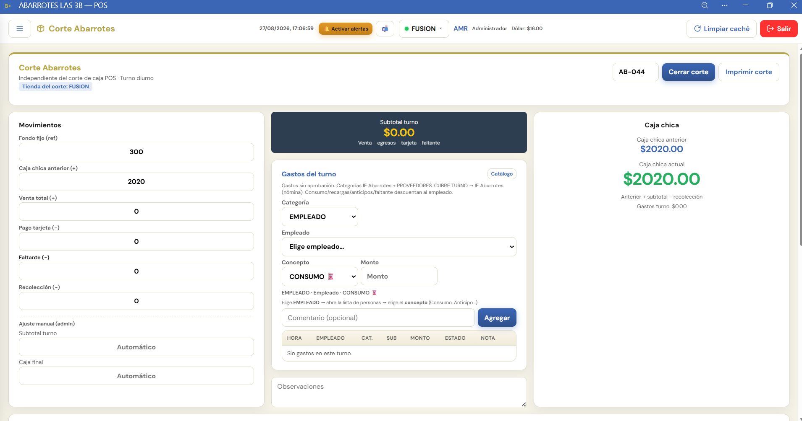

# Tutorial: Corte Abarrotes (pantalla real)

Guía interactiva basada en una **captura real** del módulo (tienda FUSION, folio AB-044).

> **En el POS:** menú → **Tutorial** → **Corte Abarrotes** (paso a paso, zonas clicables, calculadora y preguntas).

No inventa botones ni paneles que no estén en la captura. El tema de **negativo** se explica con la **Caja chica actual en rojo** y los campos con signo **(−)**.

---

## Zonas de la pantalla

| Zona | Qué es |
|---|---|
| Encabezado | Folio, **Cerrar corte**, **Imprimir corte** |
| Movimientos | Fondo fijo, caja anterior, venta, tarjeta, faltante, recolección |
| Centro | Subtotal turno + **Gastos del turno** + Observaciones |
| Caja chica | Anterior, actual, gastos del turno |

---

## Fórmulas (texto en pantalla)

- **Subtotal turno:** `Venta − egresos − tarjeta − faltante`
- **Caja chica actual:** `Anterior + subtotal − recolección`

---

## Negativo (con lo que se ve en pantalla)

Los campos **Pago tarjeta (−)**, **Faltante (−)** y **Recolección (−)** restan.

Si al aplicar gastos / faltante / recolección la **Caja chica actual** baja de $0, el monto se muestra en **rojo**: eso es el negativo en esta pantalla.

En el tutorial hay una calculadora que parte de los números de la captura (`caja anterior 2020`) y presets de ejemplo.

---

## Frase para capacitar

> **Movimientos → Gastos del turno → revisa Caja chica → Cerrar / Imprimir.**  
> Si la caja se pone en **rojo**, hay negativo: revisa faltante, gastos, tarjeta y recolección.
