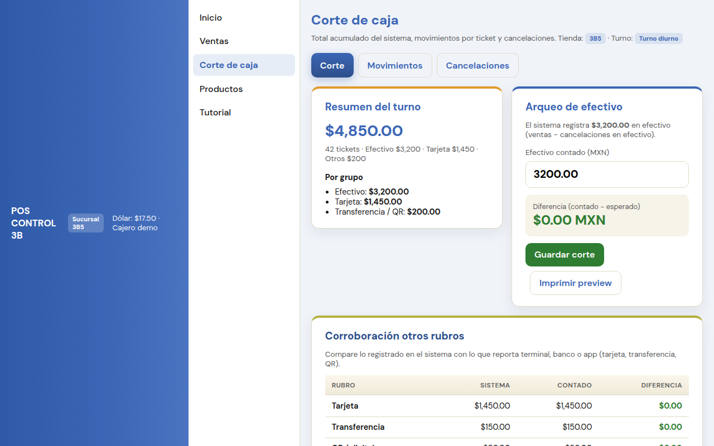

# Tutorial: Corte de caja (ventas del punto de venta)

Captura real de la UI del POS.

> **En el POS:** menú → **Tutorial** → *Corte de caja (ventas del punto de venta)*  
> Este es el corte de **Ventas** de mostrador (no Corte Virtual / Abarrotes / Garage).

---

## Pantalla

1. Menú → **Corte de caja** · confirma tienda, fecha y turno
2. Revisa **Resumen del turno**
3. **Arqueo de efectivo**: cuenta el dinero y captura **Efectivo contado**
4. **Corroboración otros rubros**: tarjeta / transferencia / QR vs terminal
5. **Guardar corte** (e imprimir si aplica)

---

## Frase

> Cuenta efectivo → arqueo → corroborar tarjeta → **Guardar corte**.
