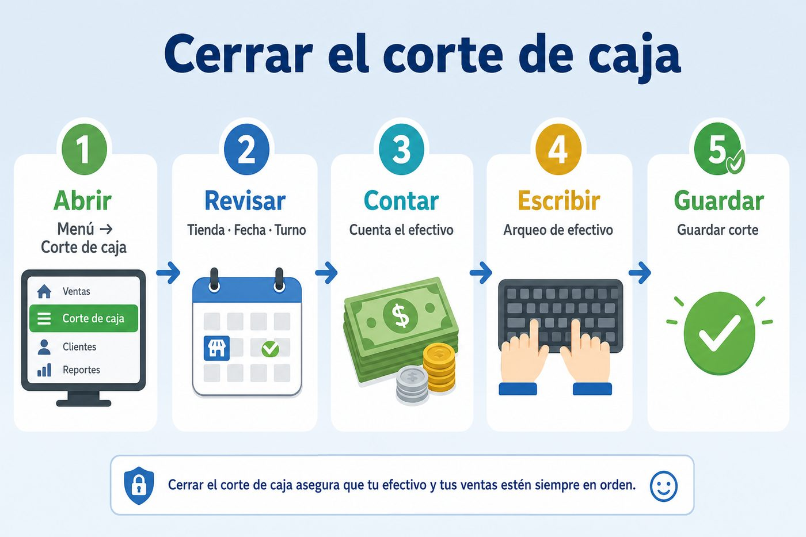
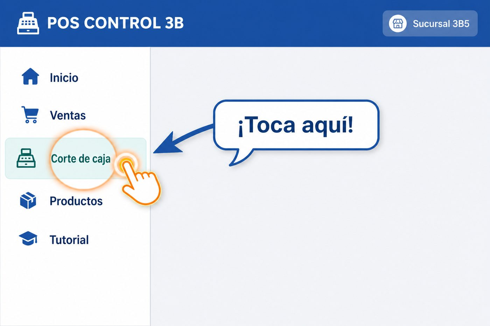
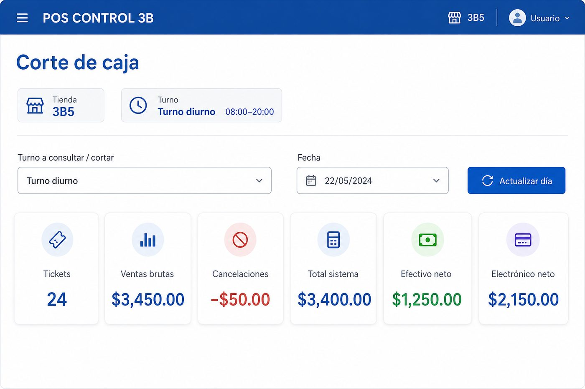
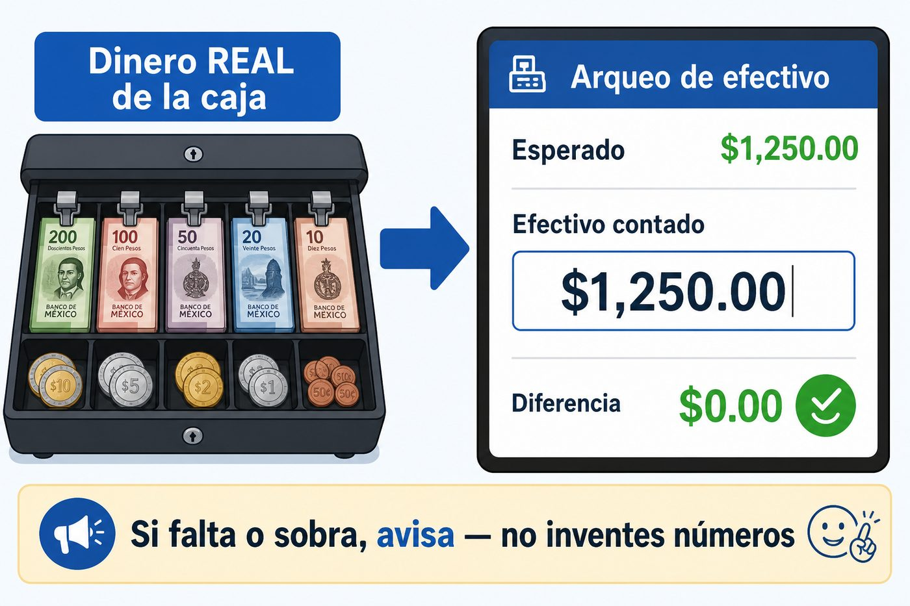
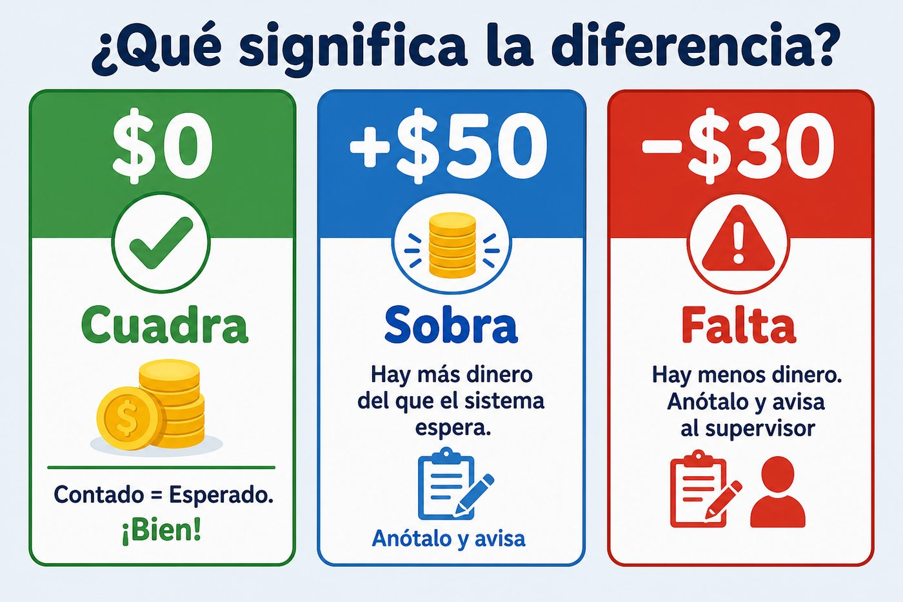
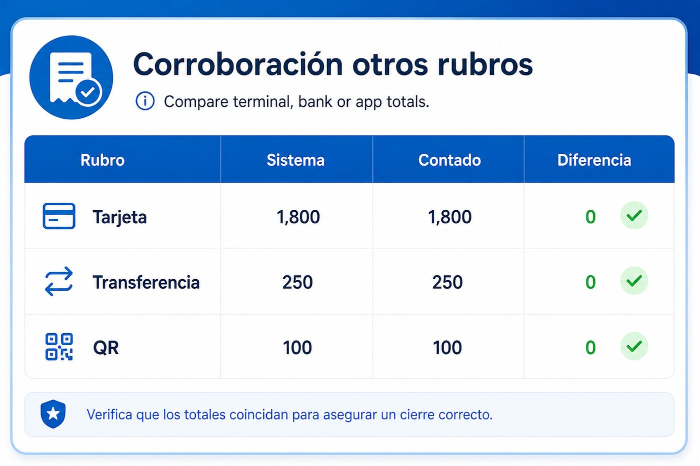
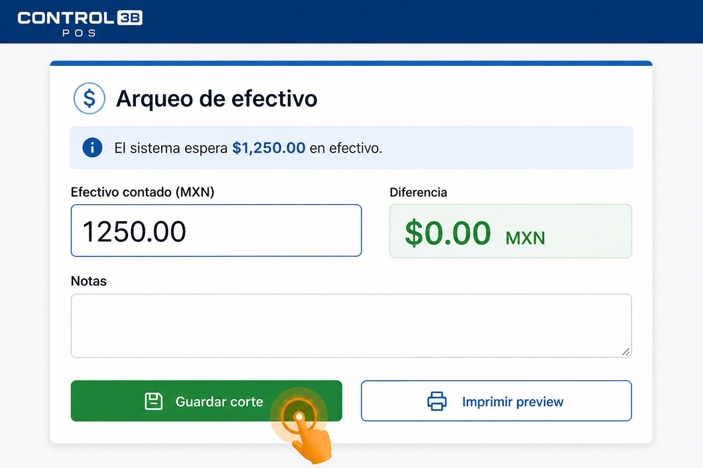

# Tutorial: Cómo cerrar el corte de caja (POS)

Cierre del **turno** en la tienda: menú → **Corte de caja** → contar efectivo → arqueo → **Guardar corte**.

> **En el POS:** menú → **Tutorial** → *Cómo cerrar el corte de caja* (interactivo, con juego de práctica y mini examen).

Las imágenes son guías visuales del flujo real del módulo **Corte de caja** (no confundir con Corte Abarrotes / Corte Virtual).

---

## El mapa (5 pasos)

1. **Abrir** — Menú → Corte de caja  
2. **Revisar** — Tienda · Fecha · Turno  
3. **Contar** — El efectivo real de la caja  
4. **Escribir** — Arqueo de efectivo  
5. **Guardar** — Guardar corte  

---

## 1. Abre Corte de caja

En el menú lateral toca **Corte de caja** (debajo de Ventas).

---

## 2. Revisa tienda, fecha y turno

Confirma:

| Campo | Qué revisar |
|---|---|
| Tienda | Que sea la tuya |
| Turno | Diurno o nocturno (el tuyo) |
| Fecha | El día correcto del turno |

Mira **Efectivo neto**: es lo que el sistema espera en caja para el arqueo.

> Si vendiste de noche: elige **Turno nocturno** y la fecha del día en que **empezó** ese turno.

---

## 3. Cuenta el dinero real

1. Saca el efectivo de la caja.  
2. Cuéntalo (billetes + monedas).  
3. Ese monto es el **efectivo contado**.

**Regla de oro:** si falta o sobra, anótalo y avisa. No inventes números.

---

## 4. Escribe el arqueo y mira la diferencia

En **Arqueo de efectivo** escribe **Efectivo contado (MXN)**.

| Diferencia | Significado |
|---|---|
| **$0** (verde) | Cuadra |
| **Positiva** (azul) | Sobra |
| **Negativa** (rojo) | Falta |

---

## 5. Corrobora tarjeta / transfer / QR

Compara lo del sistema con terminal, banco o app. Si no hubo de ese rubro, sigue la indicación de tu encargado.

---

## 6. Guarda el corte

1. Pulsa **Guardar corte**.  
2. Si el corte ya existía: **Corregir corte actual** (solo con autorización).  
3. Opcional: **Imprimir corte**.

Un corte = **una tienda + una fecha + un turno**.

---

## Errores frecuentes

- Cortar el turno equivocado (diurno vs nocturno).  
- Escribir el efectivo sin contarlo de verdad.  
- Forzar la diferencia a cero inventando el contado.  
- Ignorar cancelaciones (ya afectan el esperado).  
- Duplicar un corte que ya existe en vez de corregirlo.

---

## Frase para capacitar

**Corte de caja → revisa tienda/fecha/turno → cuenta el efectivo → escribe el contado → mira la diferencia → Guardar corte. Si no cuadra, avisa.**
