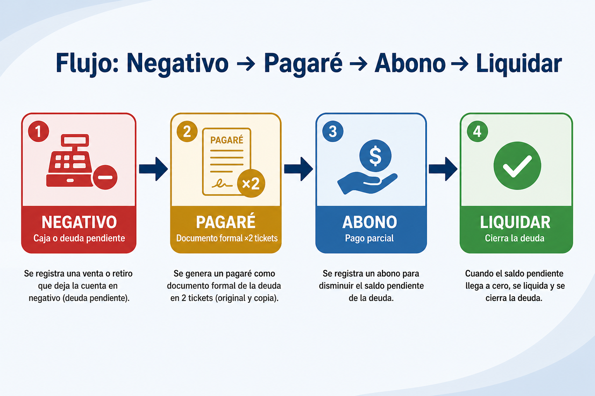
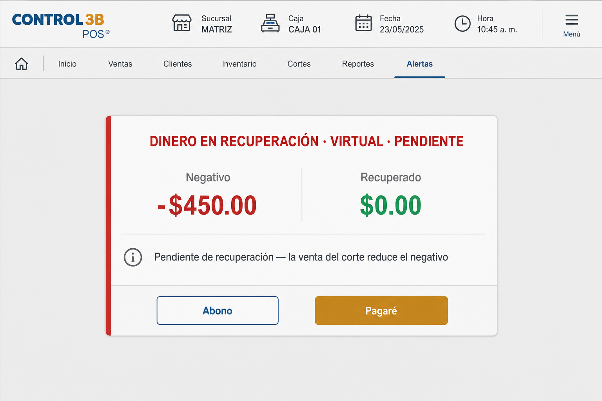
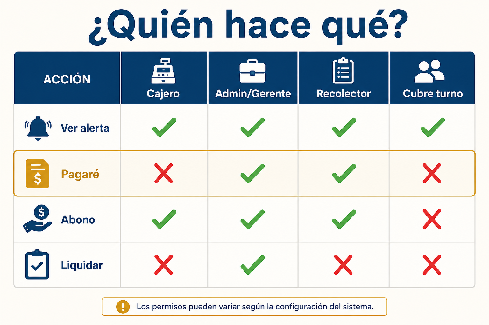
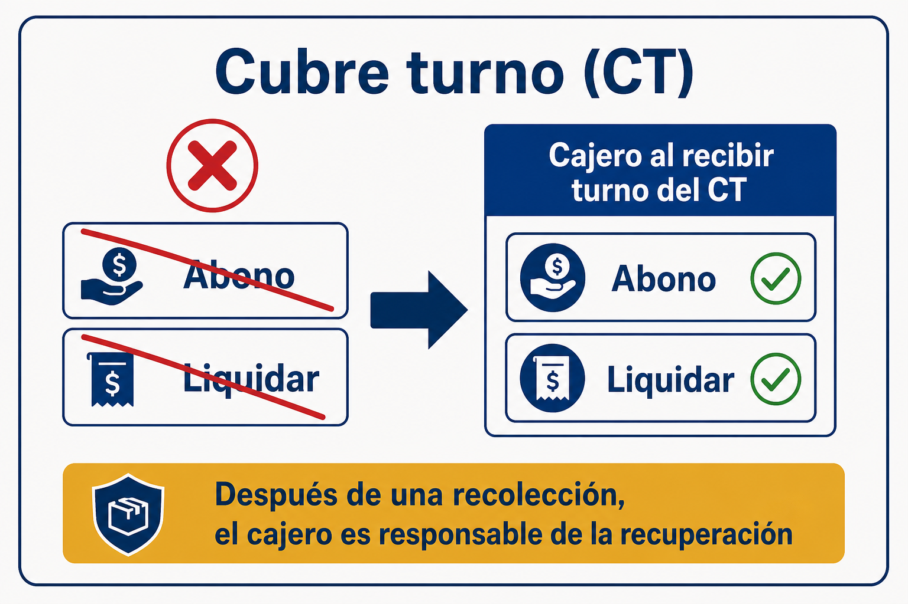
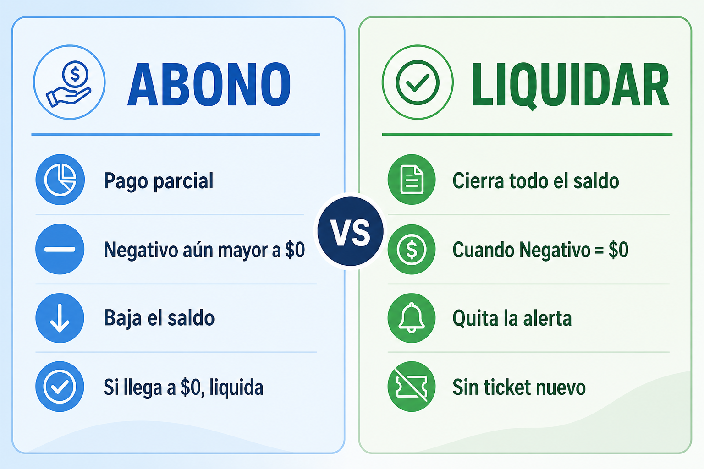
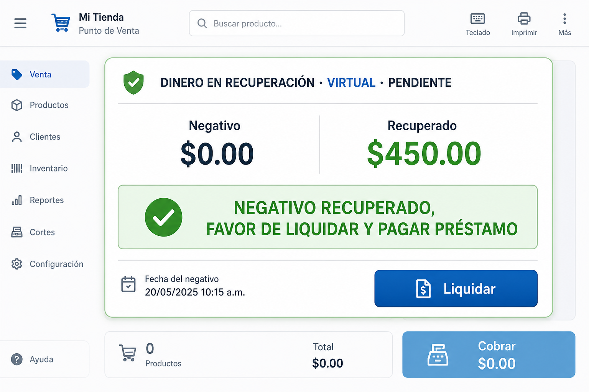
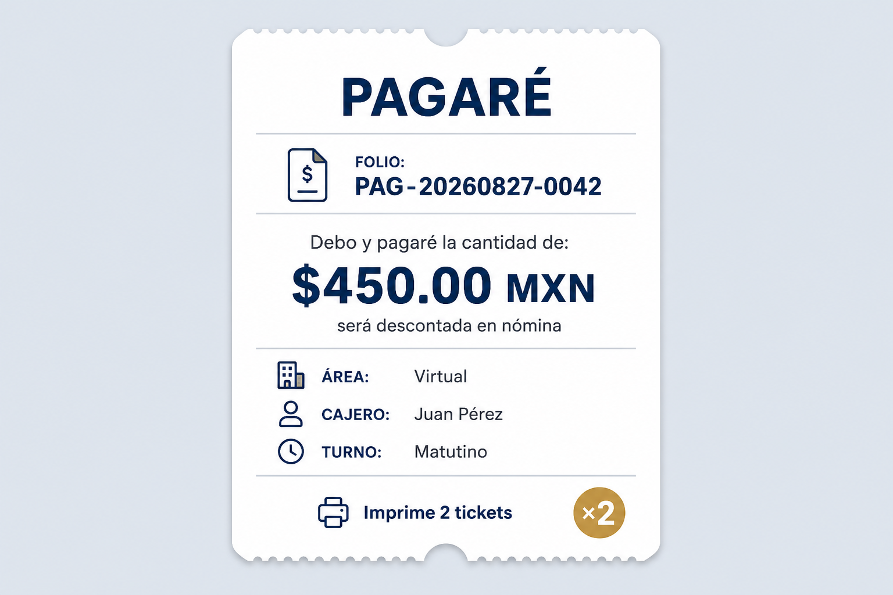

# Tutorial: Negativos, Pagaré, Abonos y Liquidaciones

Guía ilustrada para cajeros, recolectores, gerentes y administradores.

Aplica en **Corte Virtual**, **Corte Abarrotes** y **Corte Garage**.  
Documento hermano (sin imágenes): [INSTRUCTIVO_CORTES_RECOLECCIONES_ALERTAS.md](./INSTRUCTIVO_CORTES_RECOLECCIONES_ALERTAS.md).  
Tutorial interactivo enfocado en Abarrotes: [TUTORIAL_CORTE_ABARROTES_NEGATIVOS.md](./TUTORIAL_CORTE_ABARROTES_NEGATIVOS.md).

> **En el POS:** menú lateral → **Tutorial** (mismo contenido con imágenes).

---

## 1. El mapa completo

Cuando la caja o una deuda queda en rojo, el flujo correcto es:

1. Aparece la alerta **DINERO EN RECUPERACIÓN** (**Negativo**).
2. Si aún falta dinero → **Abono** (pago parcial) — lo hace el **cajero**.
3. Cuando ya se recuperó todo (**Negativo = $0**) → **Liquidar** — lo hace el **cajero**.
4. **Pagaré** (al final): **únicamente** si el negativo **sigue presente durante una recolección**. Documenta la deuda (2 tickets); no la cierra.



> **Nota importante — después de una recolección:**  
> El **cajero** es el **responsable de la recuperación** (abonar / liquidar lo pendiente).  
> El pagaré solo formaliza la deuda en el momento de la recolección; el seguimiento lo lleva el cajero en su turno.

> **Nota:** esto es el *negativo de dinero* (caja / deuda).  
> El *inventario negativo* (stock &lt; 0 en Productos) es otro tema: solo lo ve el Administrador y se corrige con ajuste de inventario, no con pagaré.

---

## 2. Qué es el “Negativo”

En el corte verás una alerta parpadeante cuando:

- hay un **pagaré** o **préstamo de área** abierto, o  
- la **caja chica** está en negativo.

Muestra dos cifras:

| Campo | Significado |
|---|---|
| **Negativo** | Lo que **aún falta** recuperar |
| **Recuperado** | Lo que **ya cubrió** la venta del corte |



### Cómo bajar el negativo

La **venta del corte** (efectivo) va reduciendo el negativo sola.  
No necesitas hacer nada especial mientras cobras: cada venta suma a **Recuperado** y baja **Negativo**.

---

## 3. Quién hace qué



| Acción | Cajero | Admin / Gerente | Recolector | Cubre turno |
|---|---|---|---|---|
| Ver la alerta | Sí | Sí | Sí | Sí |
| **Abono** | Sí | Sí | No (en corte) | **No** |
| **Liquidar** | Sí | Sí | No (en corte) | **No** |
| **Pagaré** (solo en recolección) | No | Sí | Sí | **No** |

### Cubre turno (CT): no abona ni liquida



- El **cubre turno** puede **ver** la alerta, pero **no** puede pulsar **Abono** ni **Liquidar** (tampoco **Pagaré**).
- Eso lo hace el **cajero** cuando **recibe el turno del CT** (entra con su sesión de cajero).
- Mensaje típico para CT: *“NEGATIVO RECUPERADO — EL CAJERO DEBE LIQUIDAR O ABONAR EN SU SESIÓN”*.

---

## 4. Abono (pago parcial)

Usa **Abono** cuando todavía hay **Negativo &gt; $0** y quieres registrar un pago parcial (o el monto que indiques).



### Pasos desde el corte

1. Entra como **cajero** (o admin/gerente). Si venía un CT, el cajero retoma el turno.
2. En la alerta, con Negativo restante, pulsa **Abono**.
3. Captura el monto en el prompt.
4. El saldo baja. Si el abono deja el saldo en $0, el documento se liquida solo.

### También puedes abonar en

| Documento | Ruta | Botón |
|---|---|---|
| Pagaré | **Vales y Préstamos → Pagaré** | **Abonar** |
| Préstamo área / sucursal | **Vales y Préstamos → Préstamos área / sucursal** | **Abonar** |
| Vale | **Vales y Préstamos → Vales** | **Abonar** |
| RIF | **Vales y Préstamos → RIF** | **Abonar** |
| Préstamo empleado | **Vales y Préstamos → Préstamos empleados** | **Abonar** |

---

## 5. Liquidar (cerrar la deuda)

Usa **Liquidar** cuando el **Negativo ya está en $0** (la venta recuperó el dinero) pero la alerta sigue visible.



### Pasos

1. Verás la leyenda verde:  
   **NEGATIVO RECUPERADO, FAVOR DE LIQUIDAR Y PAGAR PRÉSTAMO**  
   (si es cubre turno: *…EL CAJERO DEBE LIQUIDAR O ABONAR EN SU SESIÓN*).
2. El **cajero** (o admin/gerente) entra a su sesión — **no** el cubre turno.
3. Pulsa **Liquidar** y confirma.
4. La alerta desaparece. **No** se imprime ticket nuevo.

### Abono vs Liquidar (resumen)

| | **Abono** | **Liquidar** |
|---|---|---|
| Quién | **Cajero** (nunca CT) | **Cajero** (nunca CT) |
| Cuándo | Negativo &gt; $0 | Negativo = $0 y aún hay deuda pendiente |
| Monto | El que indiques (parcial o total) | Todo el saldo / lo recuperado |
| Efecto | Baja el saldo | Cierra el documento y quita la alerta |
| Ticket | No (desde corte) | No |

---

## 6. Pagaré (solo en recolección, al final del flujo)



### Regla de oro

El **Pagaré se genera únicamente cuando el negativo está presente durante una recolección**.

- Si no hay recolección en curso / no hay negativo en ese momento → **no** corresponde generar pagaré por esta alerta.
- El pagaré va **al final** del flujo: primero se intenta recuperar (venta / abono / liquidar); si al recolectar **aún** hay negativo, entonces se documenta con pagaré.

### Quién lo genera

**Admin / Gerente / Recolector** (no cajero, no cubre turno).

### Pasos

1. Estás en el proceso de **recolección** de la tienda correcta.
2. Si el **negativo sigue presente**, pulsa el botón dorado **Pagaré**.
3. Confirma el monto en el cuadro de diálogo.
4. El sistema:
   - registra el pagaré en **Vales y Préstamos → Pagaré**
   - lo deja visible en **Contabilidad → RC Virtual → Pagaré**
   - imprime **2 tickets** (*“Debo y pagaré la cantidad de…”*)

### Importante

- Generar el pagaré **no liquida** la deuda: solo la documenta.  
- **Después de la recolección, el cajero es el responsable de la recuperación** (abonar o liquidar cuando corresponda).  
- Folio típico: `PAG-YYYYMMDD-xxxx`.

### Seguimiento (después de la recolección)

Menú → **Vales y Préstamos** → pestaña **Pagaré**  
→ el **cajero** usa **Abonar** / **Liquidar** (o **Reimprimir ×2** si hace falta).

---

## 7. Orden correcto en tienda

```
1. Capturar TODOS los gastos del turno (incl. bonos pagados de caja)
2. Atender DINERO EN RECUPERACIÓN durante el turno
      ├─ Abono (cajero; si aún hay Negativo)
      └─ Liquidar (cajero; cuando Negativo = $0)
3. Cerrar corte
4. Recolección
      └─ Si el negativo SIGUE presente → Pagaré (admin/gerente/recolector)
5. Después de la recolección → el CAJERO es responsable de la recuperación
```

### Errores frecuentes

| Situación | Qué hacer |
|---|---|
| Recolectar con caja en negativo | El sistema lo **bloquea**. Recuperar / abonar; si el negativo permanece en la recolección → **Pagaré**. |
| Negativo ya en $0 pero la alerta sigue | El **cajero** debe pulsar **Liquidar** (no el CT). |
| Cubre turno quiere abonar o liquidar | No puede. Debe entregar turno; el **cajero** lo hace al recibir. |
| Generaron pagaré y creen que ya está cerrado | Falso. Después de la recolección, el **cajero** abona o liquida. |
| Generar pagaré fuera de una recolección | No aplica: el pagaré es **solo** cuando el negativo está presente **en la recolección**. |

---

## 8. Checklist rápido

- [ ] Tienda y área correctas (Virtual / Garage / Abarrotes)
- [ ] Revisar alerta **DINERO EN RECUPERACIÓN**
- [ ] Si falta dinero: **Abono** (cajero)
- [ ] Si Negativo = $0: **Liquidar** (cajero; nunca CT)
- [ ] Cerrar corte
- [ ] **Recolectar** — si el negativo sigue: **Pagaré** ×2 tickets
- [ ] Después de la recolección: el **cajero** es responsable de la recuperación
- [ ] Guardar tickets (corte / recolección / pagaré)

---

## 9. Dónde consultar después

| Pantalla | Para qué |
|---|---|
| **Vales y Préstamos → Pagaré** | Seguimiento; el cajero abona / liquida; reimprimir |
| **Contabilidad → RC Virtual → Pagaré** | Custodia / revisión contable |
| **Incidencias → Pendientes** | Aprobaciones de vales / préstamos (otro flujo) |

---

## Frase para capacitar

> Primero recupera: **Abono** o **Liquidar** (siempre el **cajero**, nunca el cubre turno).  
> El **Pagaré** va **al final** y **solo** si el negativo está presente **durante la recolección**.  
> Después de recolectar, el **cajero** es el **responsable de la recuperación**.
